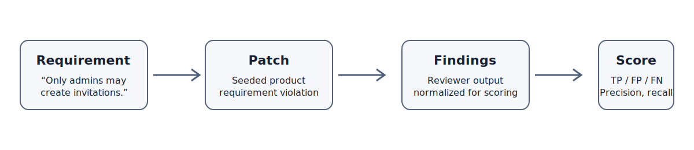
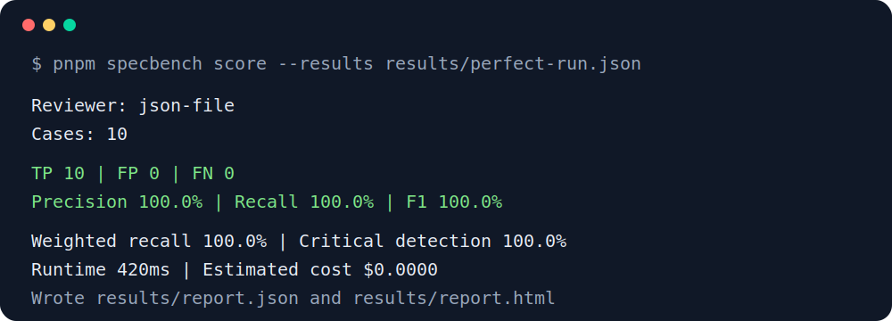
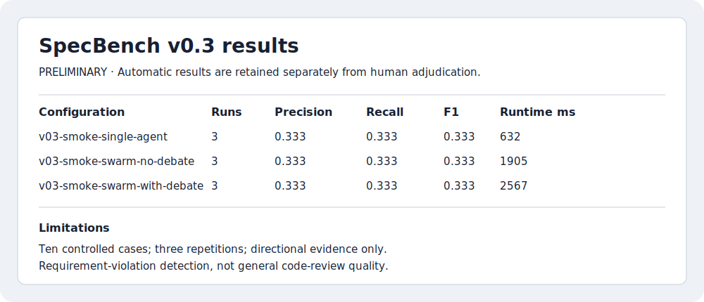
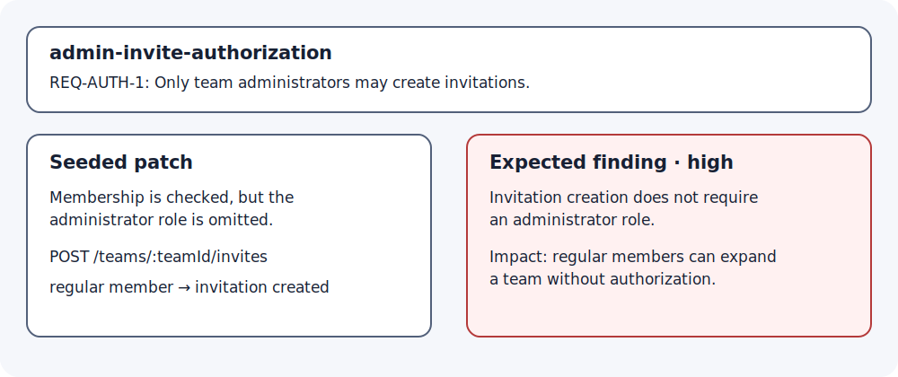

# SpecBench

SpecBench is an open-source benchmark for testing whether AI code reviewers detect explicit product and business requirement violations in code changes.

[](https://github.com/EvanGribar/SpecBench/actions/workflows/ci.yml) [](https://github.com/EvanGribar/SpecBench/releases/tag/v0.3.1-beta) [](LICENSE)

> **Experimental:** the current release is `v0.3.1-beta`. It validates the local experiment pipeline; it does not establish that any reviewer architecture or multi-agent debate approach is superior.

## Why SpecBench exists

Ordinary code-review benchmarks often ask whether a change is generally good, secure, or idiomatic. SpecBench starts with an explicit product requirement, seeds a realistic violation into a patch, and checks whether a reviewer identifies that requirement-level failure.

SpecBench measures requirement-aware review behavior. It is not a general benchmark for code quality, security, or software-engineering ability.



## What is included

The repository currently contains 10 controlled `v0.2` cases covering authorization, plan limits, validation, state transitions, product omissions, notifications, cancellations, regressions, and UX requirements. Each case records its requirement, seeded violation, expected finding, severity, source location, aliases, and plausible distractors.

The `v0.3.1-beta` release adds a single-agent configuration, controlled swarm configurations, preserved smoke-test artifacts, deterministic scoring, and a durable local budget ledger. The smoke test is execution evidence only. See the [v0.3 smoke-test documentation](docs/V0.3_LIVE_SMOKE_TEST.md), [current limitations](docs/V0.3_RESULTS.md), and [changelog](CHANGELOG.md).

## Quick start: offline and free

Requires Node.js 20+ and pnpm 10. From a fresh clone:

```bash
git clone https://github.com/EvanGribar/SpecBench.git
cd SpecBench
pnpm install --frozen-lockfile
pnpm validate
pnpm test
pnpm experiment:v0.3:dry-run
```

Run a fixture-backed review without an API key:

```bash
pnpm specbench run --reviewer json-file --fixture perfect --output results/perfect-run.json
pnpm specbench score --results results/perfect-run.json
pnpm specbench report --results results/perfect-run.json --json results/perfect-report.json --html results/perfect-report.html
```

The fixture workflow is deterministic and offline. The generated terminal report and static HTML report are ordinary local artifacts:





See the [fixture workflow](examples/fixture-workflow.md) for additional failure profiles.

## Optional live model workflow

Live commands are opt-in and use the contributor's own provider credentials. They can incur cost. Copy [.env.example](.env.example) to `.env.local`, fill in credentials locally, and never commit `.env.local` or paste keys into issues, logs, or pull requests.

```bash
pnpm experiment:v0.3:single-agent
pnpm experiment:v0.3:swarm-no-debate
pnpm experiment:v0.3:swarm-with-debate
pnpm experiment:v0.3:score
pnpm experiment:v0.3:report
```

For the bounded smoke workflow, use the preflight, budget status, and audit commands described in [the smoke-test guide](docs/V0.3_LIVE_SMOKE_TEST.md). CI never makes live model calls.

## Reviewer configurations and scoring

Available offline reviewers include `json-file`, `swarm-review` export ingestion, and fixture-backed `single-agent` execution. v0.3 experiment configurations live in [`experiments/v0.3`](experiments/v0.3).

Matching is deterministic: requirement identifiers, file/line overlap, and case-defined aliases are considered in that order. A submitted finding can satisfy only one expected finding, so duplicates become false positives. Reports include precision, recall, F1, severity-weighted recall, critical-issue detection, false positives, runtime, and estimated cost where available.



## Evidence and limitations

The current suite is small, controlled, and created by the same team as the evaluator. Published artifacts are preliminary until complete repetitions and human adjudication are available. Results are sensitive to prompts, models, randomness, case design, and matching rules. Interpret them as directional, not universal. Do not infer general code-review, security, or engineering ability from them.

## Contributing

Start with [CONTRIBUTING.md](CONTRIBUTING.md), [contributed-run acceptance](docs/CONTRIBUTED_RUNS.md), and the [roadmap](ROADMAP.md). Please use the issue templates for bugs, case proposals, contributed runs, and methodology discussions. See [SECURITY.md](SECURITY.md) for private vulnerability reporting.

## Releases and citation

- [Latest release: v0.3.1-beta](https://github.com/EvanGribar/SpecBench/releases/tag/v0.3.1-beta)
- [Changelog](CHANGELOG.md)
- [v0.3 smoke-test report](docs/V0.3_LIVE_SMOKE_TEST.md)
- [Public-readiness checklist](docs/PUBLIC_LAUNCH_CHECKLIST.md)

If SpecBench supports your work, cite the repository using [CITATION.cff](CITATION.cff). No DOI is assigned.

## License

Apache-2.0. See [LICENSE](LICENSE).
